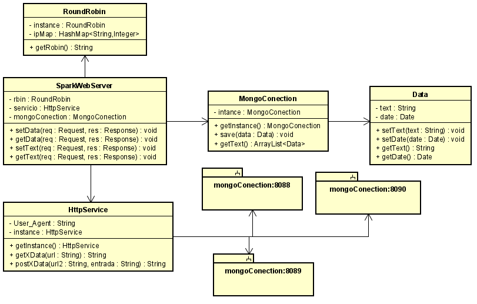
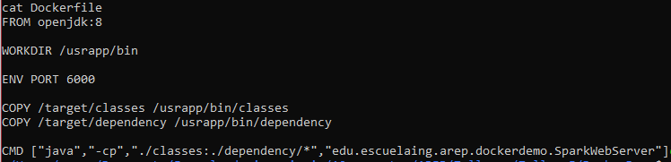
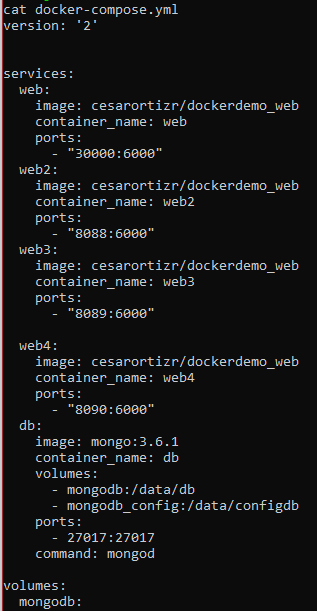
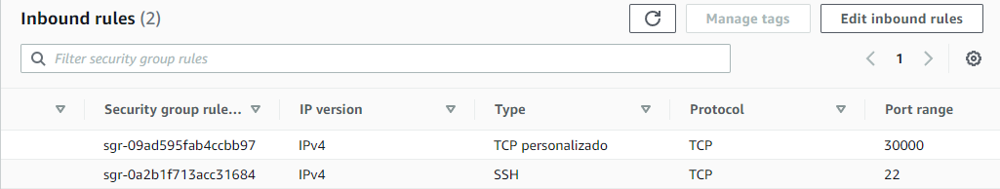
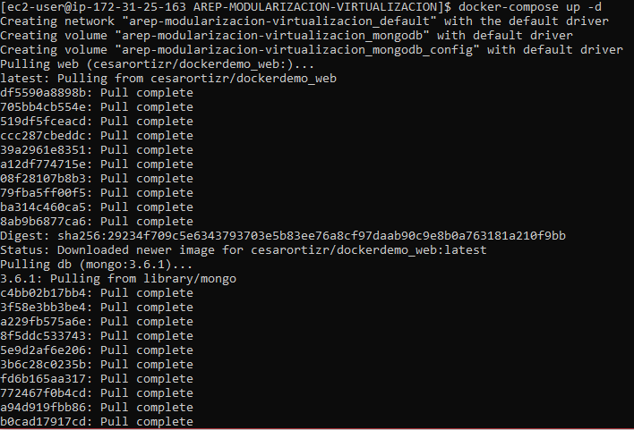
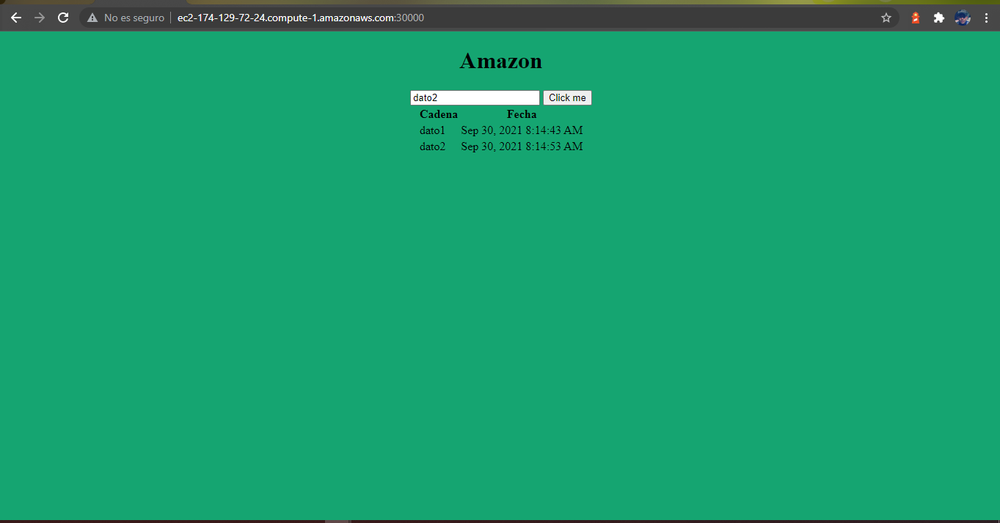
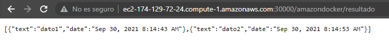
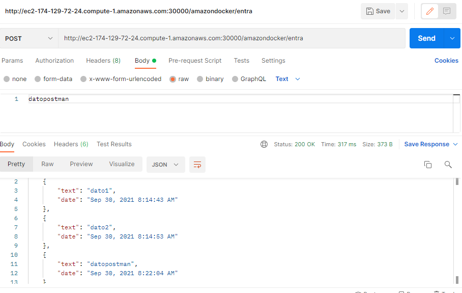

# AREP-MODULARIZACION-VIRTUALIZACION

## Objetivo

Desarrollar un aplicativo que pida un campo de texto y devuelba los 10 ultimos datos registrados haciendo uso de docker y recibiendo el mensaje por medio de un balanceador de cargas  delegando el procesamiento del mensaje y el retorno de la respuesta a cada una de las tres instancias del servicio

## Desarrollo y Descripción de la arquitectura

### Explicación de la implementación y arquitectura

En la clase **SparkWebServer** se le da inicio a la aplicación y aqui tambien se atienden las peticiones, esta clase se comunica con **RoundRobin** la cual es la clase que realiza el balanceo de carga y devuelve la dirección ip por la cual correra la base de datos, luego regresa la ip a SparkWebService y esta ip se envia a la clase **HttpService** la cual se va a encargar de conectar y traer la información de la base de datos de mongo. La clase **MongoConection** se encarga de guardar la información que llega de tipo **Data** y de traer la información almacenada en la base de datos

### Creacion de imagen 

La imagen anterior es el contenido que tiene el Dockerfile el cual nos va a ayudar a crear la imagen la cual correra la aplicación que se mostró en la arquitectura anterioemente descrita, dicja imagen debe subirse al Dockerhub para que se pueda usar en AWS

### Creación de servidores web y base de datos

La información mostrada anteriormente esta contenida en el docker-compose.yml el cual se va a encargar de construir y subir los servicios web y de bases de datos. el servicio web con el puerto 30000 se le dio permiso para correr en la maquina virtual de amazon mientras que los servicios 8088-8090 son los encargados de traer la información de la base de datos.

## Pruebas

### Asignando el puerto 30000 en AWS

### Corriendo la aplicación en la maquina virtual AWS

### Probando peticiones en el browser

* Get

* Post

